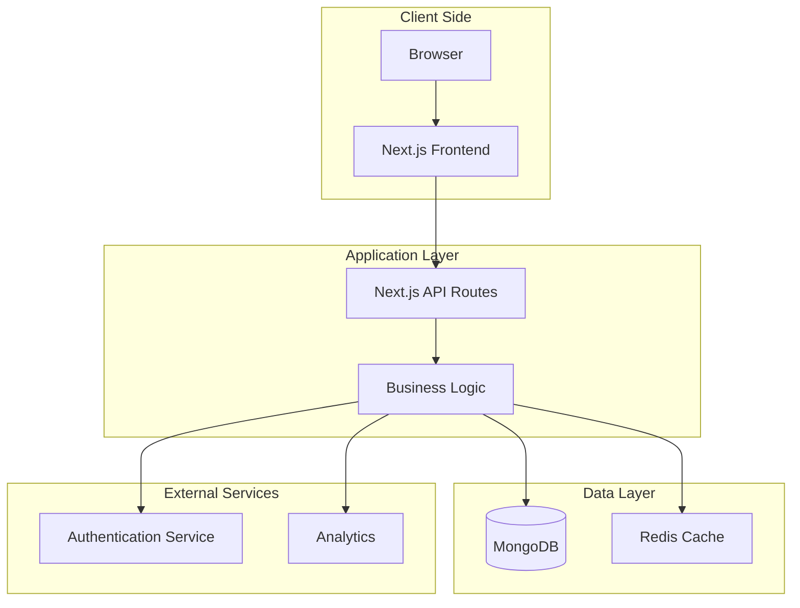
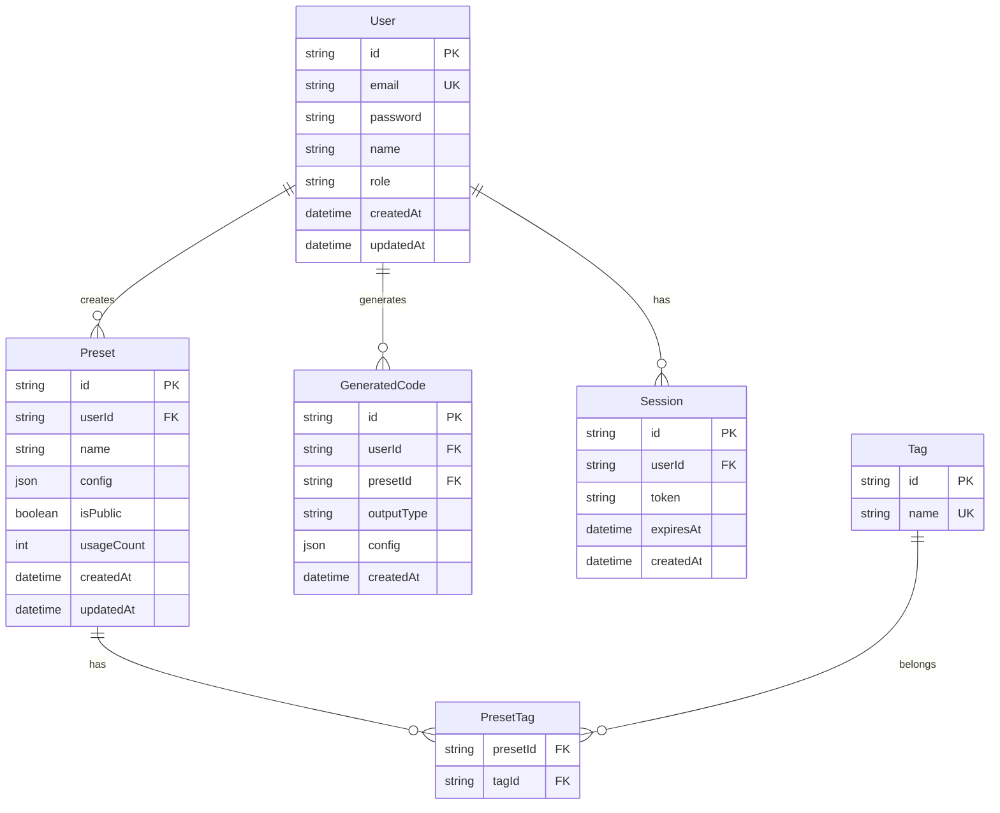
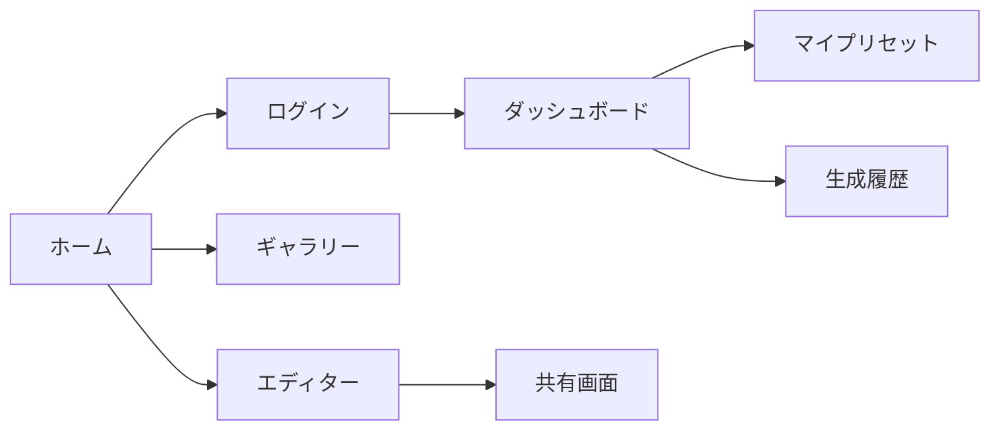
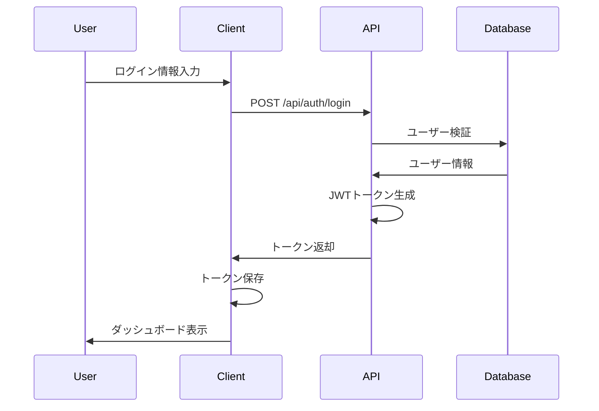
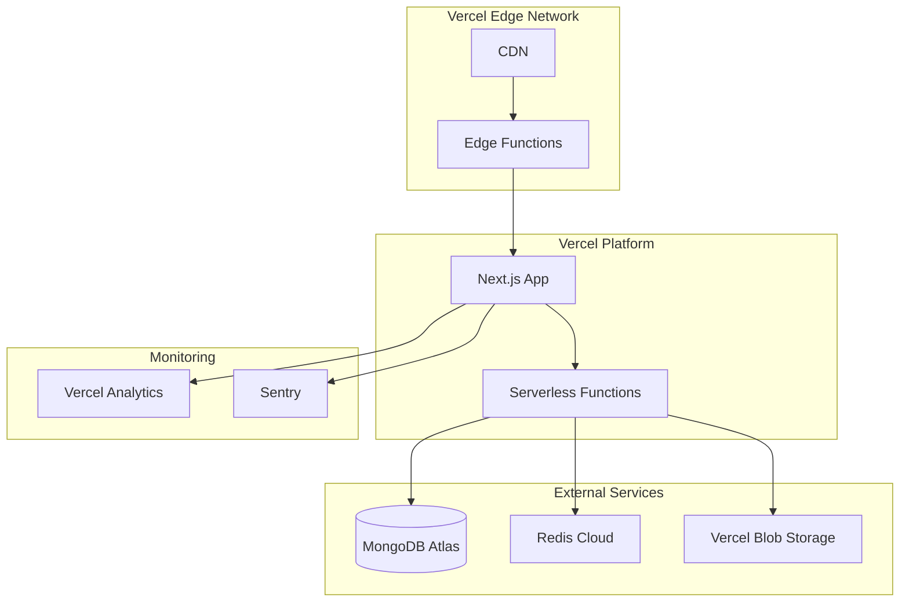

# Liquid Glass Generator - 完全設計書

## 目次
1. [プロジェクト概要](#1-プロジェクト概要)
2. [要件定義](#2-要件定義)
3. [システムアーキテクチャ](#3-システムアーキテクチャ)
4. [データベース設計](#4-データベース設計)
5. [API設計](#5-api設計)
6. [フロントエンド設計](#6-フロントエンド設計)
7. [コンポーネント設計](#7-コンポーネント設計)
8. [セキュリティ設計](#8-セキュリティ設計)
9. [インフラストラクチャ設計](#9-インフラストラクチャ設計)
10. [開発ロードマップ](#10-開発ロードマップ)
11. [テスト計画](#11-テスト計画)
12. [運用・保守計画](#12-運用保守計画)

---

## 1. プロジェクト概要

### 1.1 基本情報
- **プロジェクト名**: Liquid Glass Generator
- **バージョン**: 1.0.0
- **作成日**: 2024年1月
- **対象ユーザー**: Web開発者、デザイナー

### 1.2 プロジェクトの目的
Apple Liquid Glassデザインシステムを誰でも簡単に実装できるWebベースのビジュアルエディターを提供し、美しいガラスモーフィズムUIコンポーネントの生成を可能にする。

### 1.3 主要機能
- ビジュアルエディターによるリアルタイムプレビュー
- カスタマイズ可能なパラメータ調整
- 複数フレームワーク対応のコード生成
- プリセットテンプレート
- レスポンシブデザイン対応

---

## 2. 要件定義

### 2.1 機能要件

#### 2.1.1 ユーザー管理機能
| 機能ID | 機能名 | 説明 | 優先度 | フェーズ |
|--------|--------|------|--------|----------|
| F001 | ゲストアクセス | ログインなしで基本機能を利用可能 | 高 | MVP |
| F002 | ユーザー登録 | メールアドレスでアカウント作成 | 中 | Phase 2 |
| F003 | ログイン/ログアウト | 認証機能 | 中 | Phase 2 |
| F004 | プロフィール管理 | ユーザー情報の編集 | 低 | Phase 3 |

#### 2.1.2 エディター機能
| 機能ID | 機能名 | 説明 | 優先度 | フェーズ |
|--------|--------|------|--------|----------|
| F101 | リアルタイムプレビュー | パラメータ変更を即座に反映 | 高 | MVP |
| F102 | パラメータ調整 | ブラー、透明度、色などの調整 | 高 | MVP |
| F103 | プリセット選択 | 事前定義されたスタイルの適用 | 高 | MVP |
| F104 | カスタムプリセット保存 | ユーザー定義のプリセット | 中 | Phase 2 |
| F105 | アンドゥ/リドゥ | 操作の取り消し/やり直し | 中 | Phase 2 |

#### 2.1.3 コード生成機能
| 機能ID | 機能名 | 説明 | 優先度 | フェーズ |
|--------|--------|------|--------|----------|
| F201 | CSS生成 | 純粋なCSSコードの生成 | 高 | MVP |
| F202 | HTML生成 | HTMLとCSSの組み合わせ生成 | 高 | MVP |
| F203 | React生成 | Reactコンポーネントの生成 | 中 | Phase 2 |
| F204 | Vue生成 | Vueコンポーネントの生成 | 中 | Phase 2 |
| F205 | コピー機能 | ワンクリックでコードコピー | 高 | MVP |

### 2.2 非機能要件

#### 2.2.1 パフォーマンス要件
| 項目 | 要求値 | 測定方法 |
|------|--------|----------|
| ページロード時間 | 3秒以内 | Lighthouse |
| プレビュー更新速度 | 100ms以内 | Performance API |
| API応答時間 | 500ms以内 | サーバーログ |
| 同時接続数 | 1,000ユーザー | 負荷テスト |

#### 2.2.2 信頼性要件
| 項目 | 要求値 |
|------|--------|
| 稼働率 | 99.9% |
| MTBF | 720時間以上 |
| MTTR | 1時間以内 |

#### 2.2.3 ユーザビリティ要件
- 直感的なUI/UX
- モバイルレスポンシブ対応
- 多言語対応（日本語/英語）
- キーボードショートカット対応

---

## 3. システムアーキテクチャ

### 3.1 全体アーキテクチャ



### 3.2 技術スタック

#### フロントエンド
- **フレームワーク**: Next.js 14 (App Router)
- **言語**: TypeScript 5.3
- **UIライブラリ**: React 18.2
- **スタイリング**: Tailwind CSS 3.4
- **状態管理**: Zustand 4.5
- **フォーム**: React Hook Form 7.48
- **アニメーション**: Framer Motion 11.0

#### バックエンド
- **ランタイム**: Node.js 20 LTS
- **フレームワーク**: Next.js API Routes
- **ORM**: Prisma 5.8
- **バリデーション**: Zod 3.22

#### データベース
- **メインDB**: MongoDB Atlas
- **キャッシュ**: Redis (Phase 2)
- **ファイルストレージ**: Vercel Blob (Phase 3)

#### インフラ・ツール
- **ホスティング**: Vercel
- **CI/CD**: GitHub Actions
- **モニタリング**: Vercel Analytics
- **エラートラッキング**: Sentry

### 3.3 ディレクトリ構造

```
liquid-glass-generator/
├── app/                          # Next.js App Router
│   ├── (auth)/                   # 認証関連ページ
│   │   ├── login/
│   │   └── register/
│   ├── (dashboard)/              # ダッシュボード
│   │   └── dashboard/
│   ├── api/                      # API Routes
│   │   ├── auth/
│   │   ├── generate/
│   │   ├── presets/
│   │   └── templates/
│   ├── components/               # ページ固有コンポーネント
│   ├── layout.tsx
│   ├── page.tsx
│   └── globals.css
├── components/                   # 共通コンポーネント
│   ├── Editor/
│   │   ├── ControlPanel/
│   │   ├── PreviewArea/
│   │   └── CodeOutput/
│   ├── LiquidGlass/
│   │   ├── Card.tsx
│   │   ├── Button.tsx
│   │   └── Modal.tsx
│   └── ui/                       # 基本UIコンポーネント
├── lib/                          # ライブラリ・ユーティリティ
│   ├── api/
│   ├── auth/
│   ├── db/
│   ├── hooks/
│   ├── store/
│   ├── types/
│   └── utils/
├── prisma/                       # Prismaスキーマ
│   └── schema.prisma
├── public/                       # 静的ファイル
├── tests/                        # テストファイル
│   ├── unit/
│   ├── integration/
│   └── e2e/
├── .env.local
├── .env.example
├── next.config.js
├── tailwind.config.ts
├── tsconfig.json
└── package.json
```

---

## 4. データベース設計

### 4.1 ERD（Entity Relationship Diagram）



### 4.2 テーブル定義

#### Users テーブル
| カラム名 | データ型 | 制約 | 説明 |
|----------|----------|------|------|
| id | VARCHAR(36) | PRIMARY KEY | UUID |
| email | VARCHAR(255) | UNIQUE, NOT NULL | メールアドレス |
| password | VARCHAR(255) | NOT NULL | ハッシュ化パスワード |
| name | VARCHAR(100) | | ユーザー名 |
| role | ENUM | DEFAULT 'user' | ユーザー権限 |
| createdAt | TIMESTAMP | NOT NULL | 作成日時 |
| updatedAt | TIMESTAMP | NOT NULL | 更新日時 |

#### Presets テーブル
| カラム名 | データ型 | 制約 | 説明 |
|----------|----------|------|------|
| id | VARCHAR(36) | PRIMARY KEY | UUID |
| userId | VARCHAR(36) | FOREIGN KEY | 作成者ID |
| name | VARCHAR(100) | NOT NULL | プリセット名 |
| config | JSON | NOT NULL | 設定データ |
| isPublic | BOOLEAN | DEFAULT false | 公開設定 |
| usageCount | INT | DEFAULT 0 | 使用回数 |
| createdAt | TIMESTAMP | NOT NULL | 作成日時 |
| updatedAt | TIMESTAMP | NOT NULL | 更新日時 |

---

## 5. API設計

### 5.1 RESTful API エンドポイント

#### 認証関連
| メソッド | エンドポイント | 説明 | 認証 |
|----------|----------------|------|------|
| POST | /api/auth/register | ユーザー登録 | 不要 |
| POST | /api/auth/login | ログイン | 不要 |
| POST | /api/auth/logout | ログアウト | 必要 |
| GET | /api/auth/me | 現在のユーザー情報 | 必要 |

#### プリセット関連
| メソッド | エンドポイント | 説明 | 認証 |
|----------|----------------|------|------|
| GET | /api/presets | プリセット一覧取得 | 不要 |
| GET | /api/presets/:id | プリセット詳細取得 | 不要 |
| POST | /api/presets | プリセット作成 | 必要 |
| PUT | /api/presets/:id | プリセット更新 | 必要 |
| DELETE | /api/presets/:id | プリセット削除 | 必要 |

#### コード生成関連
| メソッド | エンドポイント | 説明 | 認証 |
|----------|----------------|------|------|
| POST | /api/generate | コード生成 | 不要 |
| GET | /api/generate/history | 生成履歴取得 | 必要 |

### 5.2 API リクエスト/レスポンス例

#### コード生成API

**リクエスト**
```json
POST /api/generate
Content-Type: application/json

{
  "config": {
    "type": "card",
    "blur": 15,
    "opacity": 0.25,
    "saturation": 180,
    "borderRadius": 12,
    "backgroundColor": "rgba(255, 255, 255, 0.25)",
    "borderColor": "rgba(255, 255, 255, 0.3)"
  },
  "outputType": "react",
  "options": {
    "typescript": true,
    "styled": false
  }
}
```

**レスポンス**
```json
{
  "success": true,
  "data": {
    "code": "import React from 'react';\n\nconst LiquidGlassCard: React.FC = () => {\n  ...",
    "language": "typescript",
    "framework": "react",
    "generatedAt": "2024-01-15T10:30:00Z"
  }
}
```

### 5.3 エラーレスポンス

```json
{
  "success": false,
  "error": {
    "code": "VALIDATION_ERROR",
    "message": "入力値が不正です",
    "details": [
      {
        "field": "config.blur",
        "message": "ブラー値は0から50の間で指定してください"
      }
    ]
  }
}
```

---

## 6. フロントエンド設計

### 6.1 画面遷移図



### 6.2 画面設計

#### 6.2.1 エディター画面

```
┌─────────────────────────────────────────────────────────┐
│  Liquid Glass Generator          [ログイン] [言語切替]   │
├─────────────────────────────────────────────────────────┤
│ ┌─────────────┬──────────────────┬──────────────────┐   │
│ │             │                  │                  │   │
│ │  コントロール │   プレビュー      │   コード出力      │   │
│ │  パネル      │   エリア          │   エリア         │   │
│ │             │                  │                  │   │
│ │ ・プリセット  │  [ライトモード]   │  [CSS] [React]  │   │
│ │ ・ブラー     │                  │                  │   │
│ │ ・透明度     │  ┌──────────┐    │  ```css        │   │
│ │ ・彩度       │  │          │    │  .glass {      │   │
│ │ ・色        │  │  カード   │    │    ...         │   │
│ │             │  │          │    │  }             │   │
│ │ [生成]      │  └──────────┘    │  ```           │   │
│ │             │                  │                  │   │
│ │             │  [ダークモード]   │  [コピー]       │   │
│ └─────────────┴──────────────────┴──────────────────┘   │
└─────────────────────────────────────────────────────────┘
```

### 6.3 状態管理設計

#### 6.3.1 グローバル状態（Zustand）

```typescript
interface AppState {
  // エディター状態
  editorConfig: LiquidGlassConfig;
  selectedPreset: string | null;
  isDarkMode: boolean;
  outputType: OutputType;
  
  // ユーザー状態
  user: User | null;
  isAuthenticated: boolean;
  
  // UI状態
  isGenerating: boolean;
  isSaving: boolean;
  
  // アクション
  updateConfig: (config: Partial<LiquidGlassConfig>) => void;
  selectPreset: (presetId: string) => void;
  toggleDarkMode: () => void;
  setOutputType: (type: OutputType) => void;
  generateCode: () => Promise<void>;
  savePreset: (name: string) => Promise<void>;
}
```

### 6.4 ルーティング設計

```typescript
// app/routes.ts
export const routes = {
  home: '/',
  editor: '/editor',
  gallery: '/gallery',
  login: '/login',
  register: '/register',
  dashboard: '/dashboard',
  myPresets: '/dashboard/presets',
  history: '/dashboard/history',
  settings: '/dashboard/settings',
  preset: (id: string) => `/preset/${id}`,
  share: (id: string) => `/share/${id}`,
} as const;
```

---

## 7. コンポーネント設計

### 7.1 コンポーネント階層

```
App
├── Layout
│   ├── Header
│   │   ├── Logo
│   │   ├── Navigation
│   │   └── UserMenu
│   └── Footer
├── Pages
│   ├── HomePage
│   ├── EditorPage
│   │   ├── ControlPanel
│   │   │   ├── PresetSelector
│   │   │   ├── ParameterSlider
│   │   │   └── ColorPicker
│   │   ├── PreviewArea
│   │   │   ├── PreviewContainer
│   │   │   └── ThemeToggle
│   │   └── CodeOutput
│   │       ├── CodeEditor
│   │       ├── LanguageSelector
│   │       └── CopyButton
│   └── GalleryPage
│       ├── PresetGrid
│       └── PresetCard
└── Common
    ├── Button
    ├── Input
    ├── Modal
    └── Toast
```

### 7.2 主要コンポーネント仕様

#### 7.2.1 ControlPanel コンポーネント

```typescript
interface ControlPanelProps {
  config: LiquidGlassConfig;
  onConfigChange: (config: Partial<LiquidGlassConfig>) => void;
  onGenerate: () => void;
  isGenerating: boolean;
}

const ControlPanel: React.FC<ControlPanelProps> = ({
  config,
  onConfigChange,
  onGenerate,
  isGenerating
}) => {
  return (
    <div className="control-panel">
      <PresetSelector 
        selected={config.presetId}
        onChange={(presetId) => onConfigChange({ presetId })}
      />
      
      <ParameterSection>
        <ParameterSlider
          label="ブラー"
          value={config.blur}
          min={0}
          max={50}
          onChange={(blur) => onConfigChange({ blur })}
        />
        
        <ParameterSlider
          label="透明度"
          value={config.opacity}
          min={0}
          max={1}
          step={0.05}
          onChange={(opacity) => onConfigChange({ opacity })}
        />
        
        <ColorPicker
          label="背景色"
          value={config.backgroundColor}
          onChange={(backgroundColor) => onConfigChange({ backgroundColor })}
        />
      </ParameterSection>
      
      <Button
        onClick={onGenerate}
        loading={isGenerating}
        variant="primary"
        fullWidth
      >
        コードを生成
      </Button>
    </div>
  );
};
```

### 7.3 デザインシステム

#### 7.3.1 カラーパレット

```typescript
const colors = {
  primary: {
    50: '#e3f2fd',
    100: '#bbdefb',
    200: '#90caf9',
    300: '#64b5f6',
    400: '#42a5f5',
    500: '#2196f3',
    600: '#1e88e5',
    700: '#1976d2',
    800: '#1565c0',
    900: '#0d47a1',
  },
  gray: {
    50: '#fafafa',
    100: '#f5f5f5',
    200: '#eeeeee',
    300: '#e0e0e0',
    400: '#bdbdbd',
    500: '#9e9e9e',
    600: '#757575',
    700: '#616161',
    800: '#424242',
    900: '#212121',
  },
  success: '#4caf50',
  warning: '#ff9800',
  error: '#f44336',
  info: '#2196f3',
};
```

#### 7.3.2 タイポグラフィ

```typescript
const typography = {
  fontFamily: {
    sans: ['Inter', 'Noto Sans JP', 'sans-serif'],
    mono: ['Fira Code', 'monospace'],
  },
  fontSize: {
    xs: '0.75rem',
    sm: '0.875rem',
    base: '1rem',
    lg: '1.125rem',
    xl: '1.25rem',
    '2xl': '1.5rem',
    '3xl': '1.875rem',
    '4xl': '2.25rem',
  },
  fontWeight: {
    normal: 400,
    medium: 500,
    semibold: 600,
    bold: 700,
  },
};
```

---

## 8. セキュリティ設計

### 8.1 認証・認可

#### 8.1.1 認証フロー



#### 8.1.2 JWT構造

```json
{
  "header": {
    "alg": "HS256",
    "typ": "JWT"
  },
  "payload": {
    "sub": "user-id",
    "email": "user@example.com",
    "role": "user",
    "iat": 1704355200,
    "exp": 1704441600
  }
}
```

### 8.2 セキュリティ対策

#### 8.2.1 実装するセキュリティ対策

| 対策 | 説明 | 実装方法 |
|------|------|----------|
| HTTPS通信 | 全通信をSSL/TLS暗号化 | Vercel標準対応 |
| CSRF対策 | CSRFトークンによる検証 | Next.js CSRF対策 |
| XSS対策 | 入力値のサニタイズ | React自動エスケープ |
| SQLインジェクション対策 | パラメータバインディング | Prisma ORM |
| レート制限 | API呼び出し回数制限 | Vercel Edge Functions |
| セキュアなセッション管理 | HTTPOnly Cookie | next-auth |

### 8.3 データ保護

#### 8.3.1 個人情報の取り扱い

```typescript
// 暗号化対象フィールド
const encryptedFields = [
  'users.email',
  'users.name',
  'sessions.token'
];

// パスワードハッシュ化
import bcrypt from 'bcryptjs';

const hashPassword = async (password: string): Promise<string> => {
  const salt = await bcrypt.genSalt(10);
  return bcrypt.hash(password, salt);
};
```

---

## 9. インフラストラクチャ設計

### 9.1 デプロイメントアーキテクチャ



### 9.2 環境構成

#### 9.2.1 環境変数

```bash
# .env.production
NODE_ENV=production
NEXT_PUBLIC_APP_URL=https://liquidglass.app

# Database
DATABASE_URL=mongodb+srv://...
REDIS_URL=redis://...

# Authentication
NEXTAUTH_URL=https://liquidglass.app
NEXTAUTH_SECRET=...
JWT_SECRET=...

# External Services
SENTRY_DSN=...
VERCEL_ANALYTICS_ID=...

# Email
SMTP_HOST=...
SMTP_PORT=587
SMTP_USER=...
SMTP_PASS=...
```

### 9.3 CI/CD パイプライン

#### 9.3.1 GitHub Actions ワークフロー

```yaml
name: CI/CD Pipeline

on:
  push:
    branches: [main, develop]
  pull_request:
    branches: [main]

jobs:
  test:
    runs-on: ubuntu-latest
    steps:
      - uses: actions/checkout@v3
      - uses: actions/setup-node@v3
        with:
          node-version: '20'
          cache: 'npm'
      
      - name: Install dependencies
        run: npm ci
      
      - name: Run linter
        run: npm run lint
      
      - name: Run type check
        run: npm run type-check
      
      - name: Run tests
        run: npm test
      
      - name: Build application
        run: npm run build

  deploy:
    needs: test
    runs-on: ubuntu-latest
    if: github.ref == 'refs/heads/main'
    steps:
      - uses: actions/checkout@v3
      - uses: vercel/action@v20
        with:
          vercel-token: ${{ secrets.VERCEL_TOKEN }}
          vercel-org-id: ${{ secrets.VERCEL_ORG_ID }}
          vercel-project-id: ${{ secrets.VERCEL_PROJECT_ID }}
          vercel-args: '--prod'
```

---

## 10. 開発ロードマップ

### 10.1 フェーズ別開発計画

#### Phase 1: MVP (4週間)

**Week 1-2: 基盤構築**
- [ ] プロジェクトセットアップ
- [ ] 基本UIコンポーネント作成
- [ ] エディター画面実装
- [ ] プレビュー機能実装

**Week 3: コア機能実装**
- [ ] パラメータ調整機能
- [ ] コード生成ロジック
- [ ] プリセット機能
- [ ] コピー/ダウンロード機能

**Week 4: 仕上げ・デプロイ**
- [ ] レスポンシブ対応
- [ ] パフォーマンス最適化
- [ ] テスト実施
- [ ] Vercelデプロイ

#### Phase 2: 機能拡張 (8週間)

**Week 5-6: ユーザー管理**
- [ ] 認証システム実装
- [ ] ユーザーダッシュボード
- [ ] プリセット保存機能

**Week 7-8: フレームワーク対応**
- [ ] Reactコード生成
- [ ] Vueコード生成
- [ ] TypeScript対応

**Week 9-10: コミュニティ機能**
- [ ] プリセットギャラリー
- [ ] 共有機能
- [ ] いいね・ブックマーク機能

**Week 11-12: 品質向上**
- [ ] A/Bテスト実装
- [ ] アナリティクス統合
- [ ] パフォーマンスチューニング

#### Phase 3: エンタープライズ対応 (12週間)

**Week 13-16: 高度な機能**
- [ ] チーム管理機能
- [ ] API公開
- [ ] Webhooks実装
- [ ] バージョン管理

**Week 17-20: エコシステム構築**
- [ ] npmパッケージ公開
- [ ] VSCode拡張機能
- [ ] Figmaプラグイン
- [ ] CLIツール

**Week 21-24: 収益化**
- [ ] 有料プラン実装
- [ ] 決済システム統合
- [ ] 使用量制限機能
- [ ] 請求書発行機能

### 10.2 マイルストーン

| マイルストーン | 目標日 | 成果物 |
|----------------|--------|--------|
| MVP リリース | Week 4 | 基本的なエディター機能 |
| ユーザー認証実装 | Week 6 | ログイン・ダッシュボード |
| マルチフレームワーク対応 | Week 8 | React/Vue対応 |
| コミュニティ機能リリース | Week 10 | ギャラリー・共有機能 |
| 商用版リリース | Week 24 | 有料プラン・API |

---

## 11. テスト計画

### 11.1 テスト戦略

#### 11.1.1 テストピラミッド

```
         E2Eテスト
        /    10%    \
       ──────────────
      /              \
     / 統合テスト 30% \
    ──────────────────
   /                  \
  /   単体テスト 60%   \
 ──────────────────────
```

### 11.2 テスト項目

#### 11.2.1 単体テスト

```typescript
// utils/generateCSS.test.ts
import { generateCSS } from '@/lib/utils/generateCSS';

describe('generateCSS', () => {
  it('should generate valid CSS for glass effect', () => {
    const config = {
      blur: 15,
      opacity: 0.25,
      saturation: 180,
    };
    
    const css = generateCSS(config);
    
    expect(css).toContain('backdrop-filter: blur(15px)');
    expect(css).toContain('background: rgba(255, 255, 255, 0.25)');
    expect(css).toContain('saturate(180%)');
  });
  
  it('should handle edge cases', () => {
    const config = {
      blur: 0,
      opacity: 1,
      saturation: 100,
    };
    
    const css = generateCSS(config);
    
    expect(css).toBeDefined();
    expect(css).not.toContain('blur(0px)');
  });
});
```

#### 11.2.2 統合テスト

```typescript
// api/generate.test.ts
import { createMocks } from 'node-mocks-http';
import handler from '@/app/api/generate/route';

describe('/api/generate', () => {
  it('should generate React component', async () => {
    const { req, res } = createMocks({
      method: 'POST',
      body: {
        config: { blur: 15, opacity: 0.25 },
        outputType: 'react',
      },
    });
    
    await handler(req, res);
    
    expect(res._getStatusCode()).toBe(200);
    const json = JSON.parse(res._getData());
    expect(json.success).toBe(true);
    expect(json.data.code).toContain('React.FC');
  });
});
```

#### 11.2.3 E2Eテスト

```typescript
// e2e/editor.spec.ts
import { test, expect } from '@playwright/test';

test.describe('Editor Flow', () => {
  test('should generate CSS code', async ({ page }) => {
    await page.goto('/');
    
    // プリセット選択
    await page.click('[data-testid="preset-modern"]');
    
    // パラメータ調整
    await page.fill('[data-testid="blur-slider"]', '20');
    
    // コード生成
    await page.click('[data-testid="generate-button"]');
    
    // 結果確認
    const code = await page.textContent('[data-testid="code-output"]');
    expect(code).toContain('backdrop-filter: blur(20px)');
    
    // コピー機能
    await page.click('[data-testid="copy-button"]');
    const notification = await page.textContent('.toast');
    expect(notification).toBe('コードをコピーしました');
  });
});
```

### 11.3 品質基準

| 項目 | 目標値 |
|------|--------|
| コードカバレッジ | 80%以上 |
| バグ密度 | 1件/KLOC以下 |
| パフォーマンススコア | 90以上 |
| アクセシビリティスコア | 100 |

---

## 12. 運用・保守計画

### 12.1 監視項目

#### 12.1.1 システム監視

```typescript
// monitoring/metrics.ts
export const metrics = {
  // パフォーマンスメトリクス
  performance: {
    pageLoadTime: 'p95 < 3s',
    apiResponseTime: 'p95 < 500ms',
    errorRate: '< 0.1%',
  },
  
  // ビジネスメトリクス
  business: {
    dailyActiveUsers: 'track',
    codeGenerationCount: 'track',
    conversionRate: '> 2%',
  },
  
  // インフラメトリクス
  infrastructure: {
    cpuUsage: '< 80%',
    memoryUsage: '< 80%',
    dbConnections: '< 100',
  },
};
```

### 12.2 アラート設定

#### 12.2.1 アラートルール

| レベル | 条件 | 通知先 | 対応時間 |
|--------|------|--------|----------|
| Critical | サービス停止 | PagerDuty | 15分以内 |
| High | エラー率 > 1% | Slack | 1時間以内 |
| Medium | レスポンス遅延 | Email | 4時間以内 |
| Low | 使用率警告 | Dashboard | 24時間以内 |

### 12.3 バックアップ戦略

#### 12.3.1 バックアップスケジュール

```yaml
backup:
  database:
    type: MongoDB Atlas
    frequency: daily
    retention: 30 days
    pointInTimeRecovery: enabled
    
  code:
    type: Git
    branches: [main, develop]
    tags: all releases
    
  userAssets:
    type: Vercel Blob
    frequency: hourly
    retention: 7 days
```

### 12.4 災害復旧計画

#### 12.4.1 RTO/RPO

| システム | RTO | RPO |
|----------|-----|-----|
| Webアプリケーション | 1時間 | 1時間 |
| データベース | 2時間 | 15分 |
| ユーザーアセット | 4時間 | 1時間 |

### 12.5 保守作業スケジュール

#### 12.5.1 定期メンテナンス

| 作業内容 | 頻度 | 実施時間 |
|----------|------|----------|
| セキュリティパッチ | 月次 | 第1火曜 2:00-4:00 |
| 依存関係更新 | 月次 | 第3火曜 2:00-3:00 |
| データベース最適化 | 四半期 | 四半期末土曜 |
| 負荷テスト | 四半期 | 四半期末日曜 |

### 12.6 サポート体制

#### 12.6.1 サポートレベル

| プラン | 対応時間 | 応答時間 | チャネル |
|--------|----------|----------|----------|
| 無料 | - | - | コミュニティ |
| 個人 | 平日 9-18時 | 24時間以内 | メール |
| チーム | 平日 9-20時 | 4時間以内 | メール・チャット |
| エンタープライズ | 24/7 | 1時間以内 | 専用サポート |

### 12.7 ドキュメント管理

#### 12.7.1 ドキュメント一覧

| ドキュメント | 更新頻度 | 責任者 |
|--------------|----------|--------|
| API仕様書 | 変更時 | 開発リード |
| ユーザーガイド | 月次 | プロダクトマネージャー |
| 運用手順書 | 四半期 | SRE |
| トラブルシューティング | 随時 | サポートチーム |

---

## 付録

### A. 用語集

| 用語 | 説明 |
|------|------|
| Liquid Glass | Appleが提唱する新しいデザイン言語 |
| Glassmorphism | 透明感のあるガラスのような効果 |
| Backdrop Filter | 背景にぼかしなどの効果を適用するCSS |
| Preset | 事前定義されたスタイル設定 |
| MVP | Minimum Viable Product（実用最小限の製品） |

### B. 参考資料

1. [Apple Liquid Glass Design Guidelines](https://developer.apple.com/design/)
2. [Next.js Documentation](https://nextjs.org/docs)
3. [Vercel Platform Documentation](https://vercel.com/docs)
4. [MongoDB Atlas Documentation](https://docs.atlas.mongodb.com/)
5. [Web Content Accessibility Guidelines (WCAG) 2.1](https://www.w3.org/WAI/WCAG21/quickref/)

### C. 更新履歴

| バージョン | 日付 | 変更内容 | 作成者 |
|------------|------|----------|--------|
| 1.0.0 | 2024-01-15 | 初版作成 | 開発チーム |
| 1.1.0 | 2024-02-01 | Phase 2 設計追加 | 開発チーム |
| 1.2.0 | 2024-03-01 | セキュリティ設計更新 | セキュリティチーム |

---

## 承認

| 役割 | 氏名 | 承認日 |
|------|------|--------|
| プロジェクトマネージャー | _____ | _____ |
| テクニカルリード | _____ | _____ |
| プロダクトオーナー | _____ | _____ |
| セキュリティ責任者 | _____ | _____ |